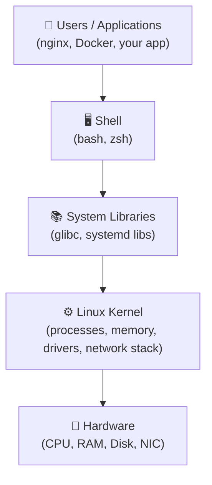
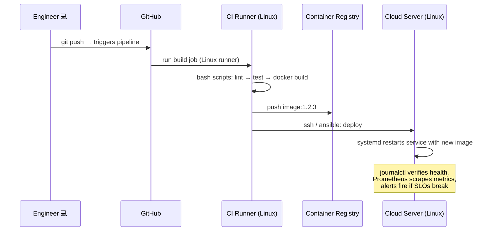

#  Linux for Cloud & DevOps Engineers

> **Complete beginner-to-production guide**: what Linux is, how it works, and why every Cloud & DevOps engineer lives in it — with a real example for every concept.

[](https://www.kernel.org/)
[](https://aws.amazon.com/)
[](./LICENSE)


## 1. What is Linux?

**Linux is a free, open-source, Unix-like operating system kernel** — the core piece of software that talks to your hardware and lets everything else run on top of it.

>  **Key fact:** Technically, "Linux" is just the **kernel**. When people say "Linux," they usually mean a full **distribution** (kernel + tools + libraries + package manager), like Ubuntu or Amazon Linux.

### A bit of history

| Year | Event |
|------|-------|
| 1991 | Linus Torvalds, a student in Finland, releases the Linux kernel as a hobby project |
| 1992 | Kernel is relicensed under the **GNU GPL** — free for everyone to use and modify |
| 2000s | Linux becomes the backbone of web servers |
| Today | **~90%+ of public cloud workloads, all top 500 supercomputers, and 100% of Android devices** run on Linux |

### Kernel vs. Operating System

| Term | Meaning | Example |
|------|---------|---------|
| **Kernel** | Core that manages CPU, memory, hardware | Linux kernel `6.8` |
| **OS / Distribution** | Kernel + GNU tools + shell + package manager | Ubuntu 24.04, Debian 12 |

### Why "open source" matters for engineers

- **Free** — no license cost when you spin up 500 cloud servers
- **Transparent** — you can read the actual source code of the system you debug
- **Hackable** — customize and automate everything from the CLI
- **Community** — decades of documentation, forums, and tooling

---

## 2. Linux Architecture — The Big Picture



| Layer | Role | DevOps Example |
|-------|------|----------------|
| **Hardware** | Physical/virtual resources | EC2 instance vCPU & EBS volume |
| **Kernel** | Allocates CPU, memory, I/O, network | Decides which process gets CPU time |
| **Libraries** | Reusable code for programs | `glibc`, OpenSSL |
| **Shell** | Command interpreter you type into | `bash` — where you run `kubectl`, `terraform` |
| **User Applications** | Your actual workload | nginx, Docker, Jenkins, Prometheus |

### 🔬 Hands-on: see the kernel in action

```bash
# Which kernel version is this server running?
uname -a
# Linux ip-172-31-5-10 6.8.0-1012-aws #12-Ubuntu SMP x86_64 GNU/Linux

# How long has it been up? (crucial before deploying)
uptime
#  14:32:01 up 45 days,  3:12,  1 user,  load average: 0.42, 0.35, 0.30
```

---

## 3. Why Cloud & DevOps Engineers Use Linux

Almost every cloud instance, container, and CI/CD runner runs Linux. Here's **why**, and a **real example** for each:

### 3.1 Servers run Linux — the cloud IS Linux
**Why:** Licensing cost, stability, and performance made Linux the default for servers. AWS, GCP, and Azure all build their platforms on it.
**Example:** When you launch an `t3.micro` on AWS, the AMI options are Amazon Linux, Ubuntu, Debian, RHEL... no Windows unless you pay extra for the license.

### 3.2 Everything is automatable from the CLI
**Why:** No GUI = every action is a command = every command can be scripted, versioned, and repeated 1,000 times identically. This is the core of **Infrastructure as Code**.
**Example:** Installing nginx on 50 servers is one loop, not 50 clicks:

```bash
for srv in web01 web02 web03; do
  ssh $srv "sudo apt install -y nginx && sudo systemctl enable --now nginx"
done
```

### 3.3 DevOps tools are built for Linux
**Why:** Docker, Kubernetes, Terraform, Ansible, Jenkins, Prometheus — all are developed, tested, and **run best** on Linux.
**Example:** A Docker container is literally an isolated Linux process tree using kernel features (`namespaces` + `cgroups`). You cannot understand containers without understanding Linux.

### 3.4 Cloud-native foundations are Linux features
**Why:** Containers, service meshes, and even serverless runtimes are built on kernel primitives.

| Cloud concept | Linux feature underneath |
|---------------|--------------------------|
| Docker container | Namespaces + cgroups |
| Container CPU/memory limits | cgroups |
| "Serverless" (Lambda) | Firecracker microVMs on Linux/KVM |
| Kubernetes pod | One or more Linux containers sharing a network namespace |
| Load balancing | `iptables` / `nftables` / eBPF |

### 3.5 Stability, security & performance
**Why:** Linux servers routinely run **years without rebooting**. Security patches ship fast. Overhead is minimal — more of your instance's resources go to your app.
**Example:** A production DB server with 500+ days uptime is completely normal (see `uptime` example in §2).

### 3.6 It's free at scale
**Why:** Windows Server licensing on hundreds of instances is expensive. Most Linux distros cost **$0**.
**Example:** An auto-scaling group going from 2 → 20 instances adds **zero OS licensing cost** on Ubuntu — the bill is only compute.

---

## 4. Linux Distributions

A **distribution (distro)** = kernel + package manager + default tools. You will meet these:

| Distro | Family | Package manager | Where you'll see it |
|--------|--------|-----------------|---------------------|
| **Ubuntu** | Debian | `apt` | Most common on cloud dev/staging |
| **Debian** | Debian | `apt` | Docker base images, stable servers |
| **Amazon Linux** | RHEL | `dnf`/`yum` | Default on AWS |
| **RHEL** | RHEL | `dnf`/`yum` | Enterprise, banks, Red Hat support |
| **Rocky/AlmaLinux** | RHEL | `dnf`/`yum` | Free RHEL replacements |
| **Alpine** | independent | `apk` | Ultra-small Docker images (5 MB) |

```bash
# Which distro am I on? (works on almost everything)
cat /etc/os-release
# NAME="Ubuntu"
# VERSION="24.04 LTS (Noble Numbat)"
```

>  **DevOps tip:** package commands differ between families. `apt install nginx` (Debian/Ubuntu) vs `dnf install nginx` (RHEL-family). Know both — Ansible's `package` module abstracts this for you.

---

## 4. Linux in the Real DevOps Workflow

How the concepts above chain together in a typical day:



| Stage | Where Linux appears |
|-------|---------------------|
| **Development** | WSL2/Mac-both-Unix, local Docker |
| **Version control** | `git` hooks are shell scripts; deploy keys = SSH |
| **CI/CD** | GitHub Actions/Ubuntu runners, bash pipeline steps, Docker builds |
| **Provisioning** | cloud-init user-data = bash; Ansible = SSH + Python over Linux |
| **Runtime** | EC2/Linux AMIs, Kubernetes nodes (Linux), containers |
| **Observability** | node_exporter, journalctl, /proc metrics |
| **Incident response** | SSH in → `top`/`ss`/`journalctl`/`curl` — every skill in this file |

---


## 5. Roadmap & Resources

### 🗺️ Learning path (4 weeks)

| Week | Focus | Goal |
|------|-------|------|
| 1 | Commands, filesystem, permissions, `vi` basics | Navigate & operate a server confidently |
| 2 | Packages, processes, networking tools | Debug connectivity & service issues |
| 3 | Bash scripting + systemd + cron | Automate a real task (backup/deploy) |
| 4 | SSH hardening, Docker on Linux, /proc & cgroups | Production-ready baseline |

### 📚 Resources

- [Linux Journey](https://linuxjourney.com/) — free, structured lessons
- **The Linux Command Line** (Shotts) — free PDF, the classic
- [Bash Guide for Beginners](https://tldp.org/LDP/Bash-Beginners-Guide/html/) (TLDP)
- `man <command>` and `<command> --help` — always available, always current
- [OverTheWire: Bandit](https://overthewire.org/wargames/bandit/) — learn by hacking games

### 🏋️ Practice projects

1. **LAMP/LEMP box:** install nginx + a simple app + systemd service + TLS with certbot
2. **Log analyzer:** bash script that emails a daily top-10-IPs report from nginx logs
3. **Mini PaaS:** one script that `git pull`s, rebuilds a Docker image, and blue/green swaps via symlinks + systemd

---

##  Final Word

Linux isn't just an OS for DevOps — **it is the substrate of the cloud**. Every container is a Linux process, every instance is a Linux box, every CI step runs bash on Linux. Master the terminal, and every cloud tool becomes legible underneath.

> *"The cloud is just someone else's Linux servers."* — now you know how to run them. 

---

*Contributions welcome — open an issue or PR!*
