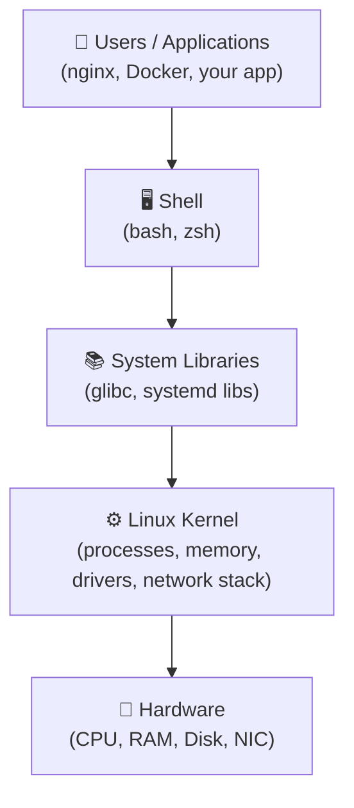
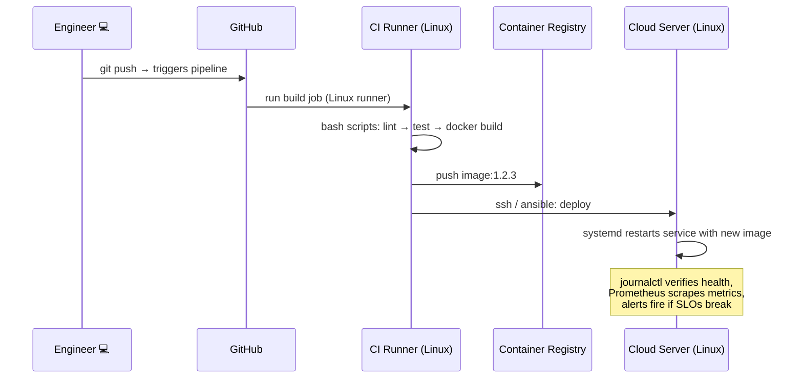

#  Linux for Cloud & DevOps Engineers

> **Complete beginner-to-production guide**: what Linux is, how it works, and why every Cloud & DevOps engineer lives in it — with a real example for every concept.

[](https://www.kernel.org/)
[](https://aws.amazon.com/)
[](./LICENSE)


## 1. What is Linux?

**Linux is a free, open-source, Unix-like operating system kernel** — the core piece of software that talks to your hardware and lets everything else run on top of it.

>  **Key fact:** Technically, "Linux" is just the **kernel**. When people say "Linux," they usually mean a full **distribution** (kernel + tools + libraries + package manager), like Ubuntu or Amazon Linux.

### A bit of history

| Year | Event |
|------|-------|
| 1991 | Linus Torvalds, a student in Finland, releases the Linux kernel as a hobby project |
| 1992 | Kernel is relicensed under the **GNU GPL** — free for everyone to use and modify |
| 2000s | Linux becomes the backbone of web servers |
| Today | **~90%+ of public cloud workloads, all top 500 supercomputers, and 100% of Android devices** run on Linux |

### Kernel vs. Operating System

| Term | Meaning | Example |
|------|---------|---------|
| **Kernel** | Core that manages CPU, memory, hardware | Linux kernel `6.8` |
| **OS / Distribution** | Kernel + GNU tools + shell + package manager | Ubuntu 24.04, Debian 12 |

### Why "open source" matters for engineers

- **Free** — no license cost when you spin up 500 cloud servers
- **Transparent** — you can read the actual source code of the system you debug
- **Hackable** — customize and automate everything from the CLI
- **Community** — decades of documentation, forums, and tooling

---

## 2. Linux Architecture — The Big Picture



| Layer | Role | DevOps Example |
|-------|------|----------------|
| **Hardware** | Physical/virtual resources | EC2 instance vCPU & EBS volume |
| **Kernel** | Allocates CPU, memory, I/O, network | Decides which process gets CPU time |
| **Libraries** | Reusable code for programs | `glibc`, OpenSSL |
| **Shell** | Command interpreter you type into | `bash` — where you run `kubectl`, `terraform` |
| **User Applications** | Your actual workload | nginx, Docker, Jenkins, Prometheus |

### 🔬 Hands-on: see the kernel in action

```bash
# Which kernel version is this server running?
uname -a
# Linux ip-172-31-5-10 6.8.0-1012-aws #12-Ubuntu SMP x86_64 GNU/Linux

# How long has it been up? (crucial before deploying)
uptime
#  14:32:01 up 45 days,  3:12,  1 user,  load average: 0.42, 0.35, 0.30
```

---

## 3. Why Cloud & DevOps Engineers Use Linux

Almost every cloud instance, container, and CI/CD runner runs Linux. Here's **why**, and a **real example** for each:

### 3.1 Servers run Linux — the cloud IS Linux
**Why:** Licensing cost, stability, and performance made Linux the default for servers. AWS, GCP, and Azure all build their platforms on it.
**Example:** When you launch an `t3.micro` on AWS, the AMI options are Amazon Linux, Ubuntu, Debian, RHEL... no Windows unless you pay extra for the license.

### 3.2 Everything is automatable from the CLI
**Why:** No GUI = every action is a command = every command can be scripted, versioned, and repeated 1,000 times identically. This is the core of **Infrastructure as Code**.
**Example:** Installing nginx on 50 servers is one loop, not 50 clicks:

```bash
for srv in web01 web02 web03; do
  ssh $srv "sudo apt install -y nginx && sudo systemctl enable --now nginx"
done
```

### 3.3 DevOps tools are built for Linux
**Why:** Docker, Kubernetes, Terraform, Ansible, Jenkins, Prometheus — all are developed, tested, and **run best** on Linux.
**Example:** A Docker container is literally an isolated Linux process tree using kernel features (`namespaces` + `cgroups`). You cannot understand containers without understanding Linux.

### 3.4 Cloud-native foundations are Linux features
**Why:** Containers, service meshes, and even serverless runtimes are built on kernel primitives.

| Cloud concept | Linux feature underneath |
|---------------|--------------------------|
| Docker container | Namespaces + cgroups |
| Container CPU/memory limits | cgroups |
| "Serverless" (Lambda) | Firecracker microVMs on Linux/KVM |
| Kubernetes pod | One or more Linux containers sharing a network namespace |
| Load balancing | `iptables` / `nftables` / eBPF |

### 3.5 Stability, security & performance
**Why:** Linux servers routinely run **years without rebooting**. Security patches ship fast. Overhead is minimal — more of your instance's resources go to your app.
**Example:** A production DB server with 500+ days uptime is completely normal (see `uptime` example in §2).

### 3.6 It's free at scale
**Why:** Windows Server licensing on hundreds of instances is expensive. Most Linux distros cost **$0**.
**Example:** An auto-scaling group going from 2 → 20 instances adds **zero OS licensing cost** on Ubuntu — the bill is only compute.

---

## 4. Linux Distributions

A **distribution (distro)** = kernel + package manager + default tools. You will meet these:

| Distro | Family | Package manager | Where you'll see it |
|--------|--------|-----------------|---------------------|
| **Ubuntu** | Debian | `apt` | Most common on cloud dev/staging |
| **Debian** | Debian | `apt` | Docker base images, stable servers |
| **Amazon Linux** | RHEL | `dnf`/`yum` | Default on AWS |
| **RHEL** | RHEL | `dnf`/`yum` | Enterprise, banks, Red Hat support |
| **Rocky/AlmaLinux** | RHEL | `dnf`/`yum` | Free RHEL replacements |
| **Alpine** | independent | `apk` | Ultra-small Docker images (5 MB) |

```bash
# Which distro am I on? (works on almost everything)
cat /etc/os-release
# NAME="Ubuntu"
# VERSION="24.04 LTS (Noble Numbat)"
```

>  **DevOps tip:** package commands differ between families. `apt install nginx` (Debian/Ubuntu) vs `dnf install nginx` (RHEL-family). Know both — Ansible's `package` module abstracts this for you.

---

## 11. SSH — The DevOps Lifeline

**SSH (Secure Shell)** is how you reach every server, GitHub repo, and CI runner. It's encrypted remote login over port 22.

### 11.1 Key-based authentication (the standard)

```bash
# 1. Generate a key pair (ED25519 — modern, short, fast)
ssh-keygen -t ed25519 -C "devops@company.com"
# → ~/.ssh/id_ed25519      (private key — NEVER share, chmod 600)
# → ~/.ssh/id_ed25519.pub  (public key — goes on servers)

# 2. Copy your public key to the server
ssh-copy-id ubuntu@52.10.20.30

# 3. Connect
ssh ubuntu@52.10.20.30
```

### 11.2 Config file — stop typing IPs

`~/.ssh/config`:

```sshconfig
Host prod-web
    HostName 52.10.20.30
    User ubuntu
    IdentityFile ~/.ssh/id_ed25519
    ServerAliveInterval 60
```

```bash
ssh prod-web          # 🎉 that simple
scp app.tar.gz prod-web:/opt/app/        # copy files over SSH
ssh prod-web "sudo systemctl restart nginx"   # run remote commands
```

### 11.3 Agent forwarding & tunnels (advanced but common)

```bash
# Port-forward a database to your laptop through a bastion host
ssh -L 5432:db.internal:5432 ubuntu@bastion.company.com
# now `psql -h localhost -p 5432` reaches the private DB ✅

# Jump through a bastion to a private instance
ssh -J ubuntu@bastion.company.com ubuntu@10.0.3.17
```

### 🔬 Real example: add a deploy key to GitHub

```bash
cat ~/.ssh/id_ed25519.pub
# ssh-ed25519 AAAAC3NzaC... devops@company.com
# → paste into GitHub repo → Settings → Deploy keys
ssh -T git@github.com
# Hi company/deploy-repo! You've successfully authenticated...
```

---

## 12. Shell Scripting for Automation

Shell scripts are your first automation tool — glue between all CLI utilities. Every CI/CD pipeline, backup job, and deploy script starts here.

### 12.1 Anatomy of a safe script

```bash
#!/usr/bin/env bash
# deploy.sh — deploy app tarball to a server directory
set -euo pipefail          # ★ e: exit on error | u: error on unset vars | pipefail

APP_NAME="myapp"
RELEASE_DIR="/opt/${APP_NAME}/releases/$(date +%Y%m%d-%H%M%S)"
TARBALL_URL="https://artifacts.internal/${APP_NAME}/latest.tar.gz"

echo "==> Deploying ${APP_NAME} to ${RELEASE_DIR}"

mkdir -p "$RELEASE_DIR"
curl -fsSL "$TARBALL_URL" | tar xz -C "$RELEASE_DIR"   # download & extract in one pipe

# switch the "current" symlink — atomic, zero-downtime trick
ln -sfn "$RELEASE_DIR" "/opt/${APP_NAME}/current"

# restart via systemd (see §13)
sudo systemctl restart "${APP_NAME}"

echo "✅ Deploy complete: $(readlink /opt/myapp/current)"
```

```bash
chmod +x deploy.sh
./deploy.sh
```

### 12.2 Core constructs

```bash
# Variables & quoting
NAME="world"
echo "Hello, ${NAME}!"        # double quotes: variables expand
echo 'Hello, ${NAME}!'        # single quotes: literal

# Conditionals
if systemctl is-active --quiet nginx; then
  echo "nginx is running"
else
  echo "nginx is DOWN — starting it"
  sudo systemctl start nginx
fi

# Loops
for env in staging production; do
  echo "Deploying to ${env}..."
  # deploy commands here
done

# Functions
log() { echo "[$(date '+%F %T')] $*"; }
log "Starting backup"

# Command substitution
HOSTNAME_SHORT=$(hostname -s)
echo "Running on ${HOSTNAME_SHORT}"

# Exit codes: 0 = success, anything else = failure
grep -q "max_connections" /etc/postgres.conf && echo "setting present" || echo "MISSING"
echo "Last command exit code: $?"
```

### 12.3 Running & debugging

```bash
bash -n script.sh      # syntax check (no execution)
bash -x script.sh      # ★ trace: prints every command before running it
shellcheck script.sh   # linter — install it, use it always
```

### 🔬 Real example: a log-cleaner cron script

```bash
#!/usr/bin/env bash
set -euo pipefail

LOG_DIR="/var/log/myapp"
DAYS_TO_KEEP=14

find "$LOG_DIR" -name "*.log" -mtime +"$DAYS_TO_KEEP" -print -delete
echo "$(date -Is) cleanup done" >> /var/log/myapp-cleanup.log
```

---

## 13. systemd & Services

**systemd** is the init system — it starts, stops, supervises, and auto-restarts services. **Every** production daemon is a systemd unit.

### 13.1 Core commands

```bash
sudo systemctl start nginx            # start now
sudo systemctl stop nginx
sudo systemctl restart nginx          # stop + start
sudo systemctl reload nginx           # reload config WITHOUT dropping connections ★
sudo systemctl enable nginx           # ★ start on boot
sudo systemctl enable --now nginx     # enable + start in one go
sudo systemctl disable nginx          # don't start on boot
systemctl status nginx                # running? PID? last log lines?
systemctl is-enabled nginx            # starts on boot?
```

### 🔬 Real example: turn your Node.js app into a managed service

`/etc/systemd/system/myapp.service`:

```ini
[Unit]
Description=MyApp Node.js API
After=network.target

[Service]
Type=simple
User=myapp
WorkingDirectory=/opt/myapp/current
Environment=NODE_ENV=production
Environment=PORT=8080
ExecStart=/usr/bin/node server.js
Restart=always
RestartSec=5
StandardOutput=append:/var/log/myapp/app.log
StandardError=append:/var/log/myapp/error.log

[Install]
WantedBy=multi-user.target
```

```bash
sudo systemctl daemon-reload          # reload unit files after editing!
sudo systemctl enable --now myapp
systemctl status myapp
# ● myapp.service - MyApp Node.js API
#    Active: active (running) since Sat 2026-10-04 14:00:00 CEST; 2min ago
#    Main PID: 2847 (node)
```

> 🎯 **Why this matters:** `Restart=always` gives you **free auto-recovery** — if the app crashes, systemd restarts it in 5 seconds, before your pager even fires. Kubernetes does the same thing at cluster scale.

### 13.2 journalctl — reading service logs

```bash
journalctl -u myapp                     # all logs for the service
journalctl -u myapp -f                  # ★ follow live (like tail -f)
journalctl -u myapp --since "1 hour ago"
journalctl -u myapp -p err              # only errors and worse
journalctl -b                           # logs since last boot
```

---

## 14. Cron & Scheduling

**cron** runs commands on a schedule — backups, cert renewals, log rotation, report generation.

```bash
crontab -e          # edit YOUR cron jobs
crontab -l          # list them
```

### Cron syntax

```
 ┌───────── minute (0-59)
 │ ┌─────── hour (0-23)
 │ │ ┌───── day of month (1-31)
 │ │ │ ┌─── month (1-12)
 │ │ │ │ ┌─ day of week (0-6, Sun=0)
 * * * * *  command
```

| Expression | Meaning |
|------------|---------|
| `*/5 * * * *` | every 5 minutes |
| `0 * * * *` | every hour at :00 |
| `30 2 * * *` | daily at 02:30 |
| `0 0 * * 0` | weekly, Sunday midnight |
| `15 3 1 * *` | 1st of month, 03:15 |

### 🔬 Real example: nightly database backup

```cron
# crontab -e
30 2 * * *  /opt/scripts/backup-db.sh >> /var/log/db-backup.log 2>&1
```

```bash
# /opt/scripts/backup-db.sh
#!/usr/bin/env bash
set -euo pipefail
BACKUP_FILE="/backups/db-$(date +%F).dump.gz"
pg_dump -h db.internal mydb | gzip > "$BACKUP_FILE"
aws s3 cp "$BACKUP_FILE" s3://company-backups/db/
find /backups -name "db-*.dump.gz" -mtime +7 -delete   # keep 7 days local
```

> 💡 **DevOps note:** prefer **systemd timers** or your orchestrator's scheduler for critical jobs — cron has no built-in retry, locking, or alerting. Tools like `flock` prevent overlapping runs: `flock -n /tmp/backup.lock backup-db.sh`.

---

## 15. Logging & Observability

Linux gives you three built-in log streams — learn them before you reach for expensive tooling.

```bash
/var/log/syslog        # (Debian) general system log
/var/log/messages      # (RHEL) general system log
/var/log/auth.log      # (Debian) SSH logins, sudo — ★ security-critical
/var/log/secure        # (RHEL) same thing
journalctl -b          # systemd's structured log of EVERYTHING
dmesg                  # kernel ring buffer: hardware/driver errors
```

### 🔬 Real example: investigate a suspicious login

```bash
# Who logged in recently?
last -20
# ubuntu   pts/0   203.0.113.7    Sat Oct  4 13:58   still logged in

# Failed SSH attempts? (brute-force check)
sudo grep "Failed password" /var/log/auth.log | tail -5
# Oct  4 13:57:42 sshd[2201]: Failed password for invalid user admin from 198.51.100.23

# Count attempts per IP
sudo grep "Failed password" /var/log/auth.log \
  | awk '{print $(NF-3)}' | sort | uniq -c | sort -rn | head
```

### The observability ladder (DevOps progression)

```
log files (journalctl, /var/log)
   → tail -f / grep  (manual)
   → logrotate (ship & compress)
   → Promtail/Loki or Fluent Bit → Grafana  (centralized)
   → metrics (node_exporter → Prometheus) + alerts (Alertmanager)
```

---

## 16. Storage & Disk Management

Cloud disks (AWS EBS volumes) show up as block devices that you **partition, format, and mount**.

```bash
lsblk                          # ★ all block devices
# NAME    SIZE  TYPE  MOUNTPOINT
# xvda     30G  disk
# └─xvda1  30G  part  /
# xvdb    100G  disk              ← new empty data volume!

df -h                          # space used per mounted filesystem
```

### 🔬 Real example: attach & mount a new EBS data volume

```bash
# 1. Identify the new disk
lsblk   # → xvdb, 100G, no mountpoint

# 2. Format it (ONE TIME ONLY — destroys data!)
sudo mkfs -t ext4 /dev/xvdb

# 3. Mount it
sudo mkdir -p /data
sudo mount /dev/xvdb /data
df -h /data

# 4. Persist across reboots → /etc/fstab (get the UUID!)
sudo blkid /dev/xvdb
# /dev/xvdb: UUID="a1b2c3d4-..." TYPE="ext4"

echo 'UUID=a1b2c3d4-... /data ext4 defaults,nofail 0 2' | sudo tee -a /etc/fstab
sudo mount -a    # verify fstab is correct — catches typos before reboot!
```

> ⚠️ **Classic disaster:** a typo in `/etc/fstab` can make a server **unbootable**. Always run `sudo mount -a` after editing, and use `nofail` for data volumes.

---

## 17. Containers: Why Linux Matters Even More

Docker isn't magic — it's a **friendly API over Linux kernel features**. Understanding the host OS makes you dramatically better at containers.

| Kernel feature | What Docker uses it for |
|----------------|------------------------|
| **Namespaces** | Isolation: each container sees its own PIDs, network, filesystem, users |
| **cgroups** | Limits: `cpus: 0.5`, `memory: 256m` are cgroup settings |
| **Union filesystem (overlayfs)** | Image layers: read-only base layers + thin writable top layer |
| **Capabilities / seccomp** | Security: drop `CAP_SYS_ADMIN`, filter syscalls |

```bash
docker run --name web -d -p 80:8080 --memory=256m --cpus=0.5 nginx
#                                                    └─ cgroups limits
#                                            └─ iptables/NAT port mapping
# inside the container, "PID 1" is actually PID 8812 on the HOST:
ps aux | grep 8812
# root 8812 ... nginx: master process nginx -g 'daemon off;'
# ↑ the same process table from §9 — namespaces just hide it
```

### Docker basics (every DevOps engineer needs these)

```bash
docker ps                       # running containers
docker ps -a                    # all (including stopped)
docker images                   # local images
docker build -t myapp:1.2 .     # build from Dockerfile
docker run -d --name api -p 8080:8080 myapp:1.2
docker logs -f api              # ★ container logs
docker exec -it api bash        # ★ open a shell INSIDE a running container
docker stats                    # live CPU/mem per container
docker stop api && docker rm api
docker system prune -f          # clean dangling resources
```

### 🔬 Real example: debug a crashed container

```bash
docker ps -a
# CONTAINER ID  STATUS                     NAMES
# a3f1b2c9d4e5  Exited (1) 2 minutes ago   api     ← exit code 1 = error

docker logs a3f1b2c9d4e5 --tail 50
# Error: connect ECONNREFUSED db:5432        ← can't reach database

docker inspect api | grep -A 5 NetworkSettings   # which network is it on?
```

---

## 18. Security Best Practices

The defaults are not enough for production. Minimum baseline:

```bash
# 1. Keep packages patched
sudo apt update && sudo apt upgrade -y

# 2. Disable root SSH login + password authentication
sudo vi /etc/ssh/sshd_config
#   PermitRootLogin no
#   PasswordAuthentication no
sudo systemctl reload sshd

# 3. Firewall — allow only what you need (Ubuntu: ufw, RHEL: firewalld)
sudo ufw allow 22/tcp
sudo ufw allow 80/tcp
sudo ufw allow 443/tcp
sudo ufw enable
sudo ufw status verbose

# 4. Never expose private keys
chmod 600 ~/.ssh/id_ed25519
chmod 700 ~/.ssh

# 5. Run services as non-root users (see §7, §13)

# 6. Audit listening ports regularly
ss -tulpn

# 7. Check auth logs for brute force
sudo grep "Failed password" /var/log/auth.log | wc -l
```

> 🔐 **Rule of thumb:** if your instance is on a public IP, **someone is scanning it within minutes**. Key-only SSH + a firewall is non-negotiable.

---

## 19. Linux in the Real DevOps Workflow

How the concepts above chain together in a typical day:



| Stage | Where Linux appears |
|-------|---------------------|
| **Development** | WSL2/Mac-both-Unix, local Docker |
| **Version control** | `git` hooks are shell scripts; deploy keys = SSH |
| **CI/CD** | GitHub Actions/Ubuntu runners, bash pipeline steps, Docker builds |
| **Provisioning** | cloud-init user-data = bash; Ansible = SSH + Python over Linux |
| **Runtime** | EC2/Linux AMIs, Kubernetes nodes (Linux), containers |
| **Observability** | node_exporter, journalctl, /proc metrics |
| **Incident response** | SSH in → `top`/`ss`/`journalctl`/`curl` — every skill in this file |

---

## 20. Interview Cheat Sheet

Q&A you'll actually get in Cloud/DevOps interviews:

**Q: What happens when you type `ls`?**
> The shell (`bash`) forks a child process, `exec`s `/bin/ls`, the kernel loads the binary, `ls` calls `getdents64()` syscalls to read the directory, formats output, writes to stdout via the `write()` syscall, and exits with code 0.

**Q: Difference between `kill` and `kill -9`?**
> `kill` sends SIGTERM (15) — the process can catch it and clean up. `kill -9` sends SIGKILL which is uncatchable and unmaskable; the process dies instantly without cleanup (can corrupt files, skip flush-to-disk). Always SIGTERM first.

**Q: How do you find what's using a port?**
> `ss -tulpn | grep :8080` (or `lsof -i :8080`). Returns PID → `ps -p <PID> -o cmd` → then kill or reconfigure.

**Q: Load average 8.0 on a 2-CPU box — what do you do?**
> `top`/`htop` to find CPU hogs (`P` to sort); `iostat`/`iotop` if it's I/O wait (`wa` high); check `dmesg` for throttling; scale the instance or fix the hot process.

**Q: How does SSH key auth work?**
> Server stores your public key in `~/.ssh/authorized_keys`. During login, the server sends a challenge encrypted with your public key; only your private key can decrypt and respond — proof of identity without ever sending the key over the wire.

**Q: A container can reach the internet but not another container — why?**
> Check: same Docker network? (`docker network ls`, `inspect`) — containers on different bridge networks can't route by default. DNS: use container names, not `localhost` (each container has its own loopback!).

**Q: What's in `/proc` and `/sys`?**
> Virtual filesystems exposing live kernel state as files: process info (`/proc/<pid>/`), CPU (`cpuinfo`), memory (`meminfo`), network stats, tunable kernel parameters (`/proc/sys/...`). Tools like `ps` and `top` just read these.

---

## 21. Roadmap & Resources

### 🗺️ Learning path (4 weeks)

| Week | Focus | Goal |
|------|-------|------|
| 1 | Commands, filesystem, permissions, `vi` basics | Navigate & operate a server confidently |
| 2 | Packages, processes, networking tools | Debug connectivity & service issues |
| 3 | Bash scripting + systemd + cron | Automate a real task (backup/deploy) |
| 4 | SSH hardening, Docker on Linux, /proc & cgroups | Production-ready baseline |

### 📚 Resources

- [Linux Journey](https://linuxjourney.com/) — free, structured lessons
- **The Linux Command Line** (Shotts) — free PDF, the classic
- [Bash Guide for Beginners](https://tldp.org/LDP/Bash-Beginners-Guide/html/) (TLDP)
- `man <command>` and `<command> --help` — always available, always current
- [OverTheWire: Bandit](https://overthewire.org/wargames/bandit/) — learn by hacking games

### 🏋️ Practice projects

1. **LAMP/LEMP box:** install nginx + a simple app + systemd service + TLS with certbot
2. **Log analyzer:** bash script that emails a daily top-10-IPs report from nginx logs
3. **Mini PaaS:** one script that `git pull`s, rebuilds a Docker image, and blue/green swaps via symlinks + systemd

---

## ⭐ Final Word

Linux isn't just an OS for DevOps — **it is the substrate of the cloud**. Every container is a Linux process, every instance is a Linux box, every CI step runs bash on Linux. Master the terminal, and every cloud tool becomes legible underneath.

> *"The cloud is just someone else's Linux servers."* — now you know how to run them. 🚀

---

*Contributions welcome — open an issue or PR!*
